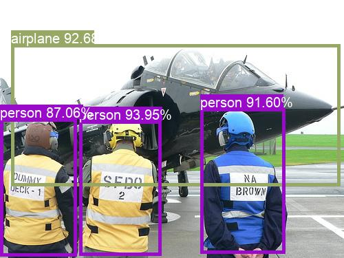

# detection-network-in-jetson
using __--input__ to input the detected image address  
using __--output__ to confirm the output folder and the output file will add "out-" before the file name  

the result will draw as rectangle and print the class and confidence  
  
the output in terminal will like the below
```
  input:airplane_0.jpg
  <detectNet.Detection object>
     -- ClassID: 5
     -- Confidence: 0.926758
     -- Left:    16.7236
     -- Top:     64.6362
     -- Right:   494.629
     -- Bottom:  270.447
     -- Width:   477.905
     -- Height:  205.811
     -- Area:    98357.9
     -- Center:  (255.676, 167.542)
  <detectNet.Detection object>
     -- ClassID: 1
     -- Confidence: 0.916016
     -- Left:    291.992
     -- Top:     157.654
     -- Right:   414.062
     -- Bottom:  368.958
     -- Width:   122.07
     -- Height:  211.304
     -- Area:    25793.9
     -- Center:  (353.027, 263.306)
  <detectNet.Detection object>
     -- ClassID: 1
     -- Confidence: 0.939453
     -- Left:    115.601
     -- Top:     175.964
     -- Right:   234.009
     -- Bottom:  371.521
     -- Width:   118.408
     -- Height:  195.557
     -- Area:    23155.5
     -- Center:  (174.805, 273.743)
  <detectNet.Detection object>
     -- ClassID: 1
     -- Confidence: 0.870605
     -- Left:    0.976562
     -- Top:     172.485
     -- Right:   111.145
     -- Bottom:  372.07
     -- Width:   110.168
     -- Height:  199.585
     -- Area:    21988
     -- Center:  (56.0608, 272.278)
```
